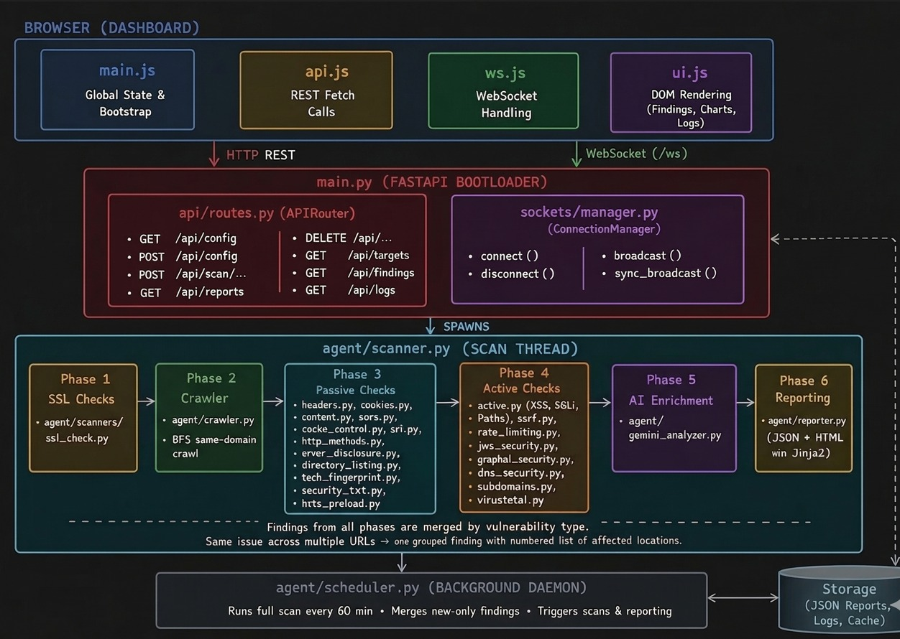

# Security Scanner

An automated, Web security audit tool that crawls a target website, runs security checks across 20+ scanner modules, enhances findings with Google Gemini AI, and presents everything in a real-time dashboard.

**Live Demo:** [https://url-security-scanner.onrender.com](https://url-security-scanner.onrender.com)

---

## Table of Contents

- [Overview](#overview)
- [Architecture](#architecture)
- [Project Structure](#project-structure)
- [Prerequisites](#prerequisites)
- [Installation](#installation)
- [Configuration](#configuration)
- [Running the Scanner](#running-the-scanner)
- [Using the Dashboard](#using-the-dashboard)
- [Scanner Modules](#scanner-modules)
- [How the AI Analysis Works](#how-the-ai-analysis-works)
- [Reports](#reports)
- [Hourly Auto-Scan Loop](#hourly-auto-scan-loop)
- [Dependencies](#dependencies)
- [Limitations & Notes](#limitations--notes)

---

## Overview

Security Scanner is a production-ready, full-stack security auditing platform built on:

- **Python + FastAPI** — modular backend with isolated API router and WebSocket manager
- **Google Gemini AI** (`gemini-3.1-flash-lite-preview`) — deep AI-powered analysis and remediation advice per finding
- **Real-time WebSocket streaming** — live scan progress pushed to the browser without polling
- **Jinja2 templated HTML reports** — self-contained, standalone scan reports rendered server-side
- **Scheduled auto-scan loop** — continuous monitoring via a background daemon thread

The scanner performs both **passive analysis** (headers, cookies, DNS, JWT, SRI, cache control) and **active probing** (XSS, SQLi, SSRF, open redirect, path discovery, GraphQL introspection) against any target URL.

---

## Architecture



---

## Project Structure

```
Security Scanner/
├── main.py                          # Lean FastAPI bootloader — mounts router & WS
├── config.json                      # Runtime scan settings (managed by dashboard)
├── requirements.txt
├── runtime.txt                      # Pins Python 3.11 for Render deployment
├── .env                             # Your API keys (never committed)
├── .gitignore
│
├── api/
│   └── routes.py                    # All REST endpoints + scan thread logic
│
├── sockets/
│   └── manager.py                   # WebSocket connection pool & broadcast engine
│
├── agent/
│   ├── scanner.py                   # Scan orchestrator — runs all phases in order
│   ├── crawler.py                   # BFS web crawler (same-domain, configurable depth)
│   ├── gemini_analyzer.py           # Gemini AI batch analysis & executive summary
│   ├── reporter.py                  # Jinja2 report renderer (JSON + HTML output)
│   ├── scheduler.py                 # Hourly daemon — runs scans, merges findings
│   └── scanners/
│       ├── ssl_check.py             # SSL/TLS cert validation, cipher & version checks
│       ├── headers.py               # HTTP security header checks (CSP, HSTS, etc.)
│       ├── cookies.py               # Cookie flag checks (HttpOnly, Secure, SameSite)
│       ├── content.py               # HTML/JS content: secrets, libs, CSRF, eval()
│       ├── cors.py                  # CORS misconfiguration checks
│       ├── active.py                # Active probes: XSS, SQLi, sensitive paths, redirects
│       ├── cache_control.py         # Cache-Control & Pragma header analysis
│       ├── sri.py                   # Subresource Integrity check for external scripts
│       ├── http_methods.py          # Dangerous HTTP methods (TRACE, PUT, DELETE)
│       ├── error_disclosure.py      # Verbose error page detection
│       ├── directory_listing.py     # Open directory listing detection
│       ├── tech_fingerprint.py      # Technology stack fingerprinting
│       ├── security_txt.py          # security.txt policy file check (RFC 9116)
│       ├── hsts_preload.py          # HSTS preload list validation
│       ├── ssrf.py                  # Server-Side Request Forgery probe
│       ├── rate_limiting.py         # Rate limiting / brute-force protection check
│       ├── jwt_security.py          # JWT token weakness detection
│       ├── graphql_security.py      # GraphQL introspection & DoS checks
│       ├── dns_security.py          # DNS security (SPF, DMARC, DNSSEC, CAA)
│       ├── subdomains.py            # Subdomain enumeration & takeover detection
│       └── virustotal.py            # VirusTotal domain reputation check
│
├── ui/
│   ├── templates/
│   │   ├── index.html               # Dashboard SPA shell (Jinja2)
│   │   └── report_template.html     # Standalone HTML report template (Jinja2)
│   └── static/
│       ├── style.css                # Dark theme CSS
│       └── js/
│           ├── main.js              # Global state (scanRunning, findings, filters)
│           ├── api.js               # REST fetch wrappers (scan, config, reports)
│           ├── ws.js                # WebSocket client & message dispatcher
│           └── ui.js                # DOM rendering (cards, charts, logs, summary)
│
└── reports/                         # Auto-generated output (gitignored)
    ├── scan_<id>_<timestamp>.json
    └── scan_<id>_<timestamp>.html
```

---

## Prerequisites

- **Python 3.10+**
- **Google Gemini API key** — free at [aistudio.google.com](https://aistudio.google.com)
- Internet access to reach the target URL

---

## Installation

```bash
# 1. Clone or download the project
cd URL_Security_Scanner

# 2. Create a virtual environment (recommended)
python -m venv venv
venv\Scripts\activate        # Windows
# source venv/bin/activate   # macOS / Linux

# 3. Install dependencies
pip install -r requirements.txt
```

---

## Configuration

### 1. Create a `.env` file

Create a file named `.env` in the root directory:

```env
GEMINI_API_KEY=your_gemini_api_key_here
GEMINI_MODEL=gemini-3.1-flash-lite-preview
VIRUSTOTAL_API_KEY=your_virustotal_api_key_here
```

### 2. `config.json`

Managed automatically by the dashboard, but can also be edited manually:

```json
{
  "target_url": "https://example.com",
  "max_pages": 30,
  "crawl_delay": 1.0,
  "hourly_scan_enabled": false,
  "last_scan": null
}
```

| Field | Description | Default |
|---|---|---|
| `target_url` | Website to scan | `""` |
| `max_pages` | Max pages to crawl (5–100) | `30` |
| `crawl_delay` | Seconds between requests (0.3–5.0) | `1.0` |
| `hourly_scan_enabled` | Enable background auto-scan | `false` |
| `last_scan` | ISO timestamp of last completed scan | `null` |

---

## Running the Scanner

```bash
python main.py
```

Open your browser at:

```
http://localhost:8000
```

---

## Using the Dashboard

The dashboard has four pages accessible from the left sidebar:

### Dashboard
- Live metrics: Overall Risk, Total, Critical, High, Medium, Low, Info
- AI-generated Executive Summary and Immediate Actions
- Severity doughnut chart (Chart.js)
- Live scan log preview (WebSocket streamed)

### Findings
- All findings from the latest scan or any loaded report
- **Filter bar** — All / Critical / High / Medium / Low / Info
- Each card shows: severity badge, title, affected location count, category
- Expand (▼) to see: Description, Real-World Impact, Technical Details, numbered affected URLs with evidence snippets, Fix Suggestion, code example, OWASP tag, CWE tag

### Reports (History)
- Last 20 scans sorted newest first
- Shows target URL, time, severity badges, overall risk
- Click any row to load findings into the Findings view
- **View Details ↗** opens the full standalone HTML report in a new tab
- **Delete** removes both JSON + HTML report files

### Live Log
- Full real-time log of every scanner step, pushed via WebSocket
- Persists up to 200 lines · scroll-to-bottom on new entries

### Sidebar Controls

| Control | Description |
|---|---|
| Target URL | Website to scan |
| Max Pages | Crawler page limit |
| Delay (s) | Crawl delay between requests |
| Hourly Auto-Scan | Toggle background scan loop |
| Run Scan Now | Trigger an immediate scan |

---

## Scanner Modules

| Module | File | What It Checks |
|---|---|---|
| SSL / TLS | `ssl_check.py` | Certificate validity, expiry, deprecated TLS, weak ciphers |
| HTTP Headers | `headers.py` | CSP, HSTS, X-Frame-Options, X-Content-Type-Options, Referrer-Policy |
| Cookies | `cookies.py` | HttpOnly, Secure, SameSite flags |
| Content | `content.py` | Hardcoded secrets, outdated JS libs, CSRF tokens, eval(), mixed content |
| CORS | `cors.py` | Wildcard origins, reflected origins, null origin |
| Active Probes | `active.py` | XSS reflection, SQLi error detection, sensitive path exposure, open redirects |
| Cache Control | `cache_control.py` | Missing or misconfigured Cache-Control / Pragma headers |
| SRI | `sri.py` | Missing Subresource Integrity on external scripts/styles |
| HTTP Methods | `http_methods.py` | Dangerous methods enabled (TRACE, PUT, DELETE) |
| Error Disclosure | `error_disclosure.py` | Verbose stack traces or debug info in error responses |
| Directory Listing | `directory_listing.py` | Open directory index pages |
| Tech Fingerprint | `tech_fingerprint.py` | Server/framework version disclosure |
| Security.txt | `security_txt.py` | Presence and validity of security.txt (RFC 9116) |
| HSTS Preload | `hsts_preload.py` | HSTS preload list inclusion check |
| SSRF | `ssrf.py` | Server-Side Request Forgery via open redirect parameters |
| Rate Limiting | `rate_limiting.py` | Missing rate limit / brute-force protection headers |
| JWT Security | `jwt_security.py` | Weak JWT algorithms (none, HS256 with default secret) |
| GraphQL | `graphql_security.py` | Introspection enabled, no depth limiting |
| DNS Security | `dns_security.py` | SPF, DMARC, DNSSEC, CAA record checks |
| Subdomains | `subdomains.py` | Subdomain enumeration and takeover risk |
| VirusTotal | `virustotal.py` | Domain reputation and malware flagging |

---

## How the AI Analysis Works

After all scanner modules run, raw findings are sent to **Google Gemini** in batches of 20:

```
Raw findings → Gemini prompt → AI-enhanced findings
```

Gemini enriches each finding with:

| Field | Description |
|---|---|
| `enhanced_severity` | Re-assessed severity based on real-world exploitability |
| `impact` | Plain-English real-world impact statement |
| `technical_details` | In-depth technical explanation |
| `fix_suggestion` | Specific, copy-paste-ready remediation |
| `code_example` | Working code fix (Nginx config, JS, response headers, etc.) |
| `priority` | Fix order (1 = most urgent) |
| `references` | CVE / CWE / OWASP references |

Gemini also produces an **executive summary** with:
- Overall risk level + risk score (0–100)
- Top 3 key findings
- Top 3 immediate actions
- 2–3 sentence executive summary

If Gemini is unavailable or rate-limited, the scanner falls back to raw findings gracefully.

---

## Reports

Every completed scan writes two files to `reports/`:

### `scan_<id>_<timestamp>.json`
Full machine-readable report: all findings, occurrences, Gemini enhancements, severity counts, metadata.

### `scan_<id>_<timestamp>.html`
Standalone self-contained HTML file rendered from `ui/templates/report_template.html` via Jinja2:
- Metric cards (Overall Risk, Total, Critical, High, Medium, Low, Info, Pages Scanned)
- Executive Summary
- Key Findings & Immediate Actions (two-column)
- Interactive filterable findings with expandable detail panels

Access directly at:
```
http://localhost:8000/api/reports/<filename>/html
```

---

## Hourly Auto-Scan Loop

The scheduler (`agent/scheduler.py`) runs in a **background daemon thread** using the `schedule` library.

**Enable via:**
- Toggle "Hourly Auto-Scan" in the sidebar UI, or
- Set `"hourly_scan_enabled": true` in `config.json`

**Behaviour:**
- Runs a full scan every 60 minutes
- Progress streams live to all connected WebSocket clients
- New findings are **merged into the existing history report** for the same target — only net-new vulnerabilities are appended, avoiding duplicate noise
- Auto-starts on server boot if enabled in `config.json`
- Toggle off at any time from the sidebar


## Dependencies

| Package | Version | Purpose |
|---|---|---|
| `fastapi` | 0.111.0 | Web framework |
| `uvicorn[standard]` | 0.30.0 | ASGI server |
| `google-generativeai` | 0.7.2 | Gemini AI SDK |
| `requests` | 2.32.3 | HTTP crawling & probing |
| `beautifulsoup4` | 4.12.3 | HTML parsing |
| `lxml` | 5.2.2 | Fast HTML/XML backend |
| `python-dotenv` | 1.0.1 | `.env` loading |
| `schedule` | 1.2.2 | Hourly scan scheduler |
| `aiofiles` | 23.2.1 | Async file I/O |
| `jinja2` | 3.1.4 | HTML report templating |
| `python-multipart` | 0.0.9 | Form parsing |
| `websockets` | >=10,<12 | WebSocket transport |
| `pyOpenSSL` | 24.1.0 | SSL/TLS inspection |
| `dnspython` | 2.6.1 | DNS record lookups |
| `PyJWT` | 2.8.0 | JWT token analysis |


## Limitations & Notes

- **Non-destructive probes** — XSS uses a benign marked string (`<bhk-xss-test>`); SQLi only detects database error messages, never extracts data.
- **Rate limiting** — Configurable crawl delay (default 1s) prevents overwhelming target servers.
- **Same-domain only** — The crawler never follows external links.
- **No headless browser** — JS-rendered SPAs may not be fully crawled; HTTP requests only.
- **Gemini rate limits** — Findings are batched in groups of 20 to stay within free API quotas.
- **Authorized use only** — Only scan websites you own or have explicit written permission to test.